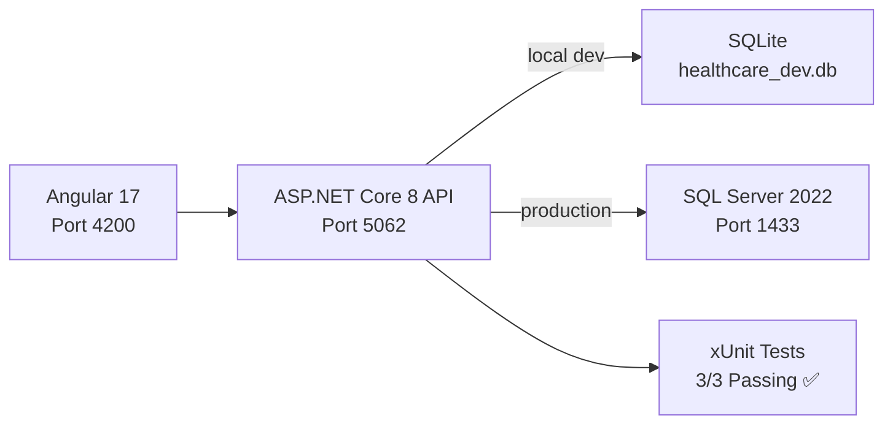

# Healthcare Patient Management System

Full-stack healthcare reference application built with **C# / .NET 8**, **Angular 17**, and **Entity Framework Core 8**.  
Runs locally without Docker — the development environment uses **SQLite** so no database server installation is required.

## Tech Stack

| Layer | Technology |
|---|---|
| Backend API | ASP.NET Core 8 Web API |
| ORM | Entity Framework Core 8 |
| Database (local dev) | SQLite (auto-created on startup) |
| Database (production) | SQL Server 2022 |
| Frontend | Angular 17 (standalone components, reactive forms) |
| Unit Tests | xUnit 2.8 + EF Core In-Memory |
| Frontend Tests | Karma + Jasmine + ChromeHeadless |

## Architecture



### Backend Layers
- `Controllers` — REST endpoints: `/api/patients`, `/api/appointments`
- `Services` — business logic: patient lifecycle, overlap-safe appointment scheduling
- `Data` — `AppDbContext` with EF Core migrations
- `Domain` — entities: `Patient`, `Appointment`, `TreatmentPlan`
- `DTOs` — request/response models with record types
- `Tests` — xUnit service tests using EF Core In-Memory provider

### Frontend
- Standalone Angular 17 app with `inject()` DI pattern
- `PatientApiService` for typed HTTP communication
- Reactive forms for patient registration and appointment booking
- Live patient and appointment list views

## Project Structure

```text
.
├── src/
│   ├── backend/
│   │   ├── Healthcare.PatientManagement.Api/
│   │   │   ├── Controllers/
│   │   │   ├── Services/
│   │   │   ├── Data/
│   │   │   ├── Domain/
│   │   │   ├── DTOs/
│   │   │   ├── Properties/launchSettings.json
│   │   │   ├── appsettings.json              ← SQL Server (production)
│   │   │   ├── appsettings.Development.json  ← SQLite (local dev)
│   │   │   └── Program.cs
│   │   ├── Healthcare.PatientManagement.Tests/
│   │   └── Healthcare.PatientManagement.sln
│   └── frontend/
│       └── src/app/
│           ├── components/
│           ├── models/
│           └── services/
├── database/
│   └── init.sql
└── docker-compose.yml
```

## Local Development (No Docker Required)

### Prerequisites
- [.NET 8 SDK](https://dotnet.microsoft.com/download/dotnet/8.0)
- [Node.js 20 LTS](https://nodejs.org/) and npm
- Angular CLI: `npm install -g @angular/cli`

> **No SQL Server needed.** The API automatically creates a local `healthcare_dev.db` SQLite file on first startup when `ASPNETCORE_ENVIRONMENT=Development`.

### 1. Run the Backend API

```bash
cd src/backend/Healthcare.PatientManagement.Api
dotnet restore
dotnet run
```

API is available at `http://localhost:5062`  
Swagger UI: `http://localhost:5062/swagger`

### 2. Run the Frontend (new terminal)

```bash
cd src/frontend
npm install
npx ng serve --port 4200
```

App is available at `http://localhost:4200`

## Running Tests

### Backend (xUnit — 3/3 passing ✅)

```bash
cd src/backend
dotnet test Healthcare.PatientManagement.sln --verbosity normal
```

### Frontend (Karma/Jasmine)

```bash
cd src/frontend
npm test
```

### Frontend Production Build

```bash
cd src/frontend
npm run build
```

## Production: Docker Compose (SQL Server)

For production-like setup with SQL Server, use Docker Compose:

```bash
docker compose up --build
```

| Service | URL |
|---|---|
| Frontend | http://localhost:4200 |
| API | http://localhost:5062 |
| SQL Server | localhost:1433 |

```bash
docker compose down   # stop all services
```

## API Reference

### Patients

| Method | Endpoint | Description |
|---|---|---|
| `GET` | `/api/patients` | List all patients |
| `GET` | `/api/patients/{id}` | Get patient by ID |
| `POST` | `/api/patients` | Register new patient |
| `PUT` | `/api/patients/{id}` | Update patient |
| `DELETE` | `/api/patients/{id}` | Delete patient |

**Create patient — request body:**
```json
{
  "firstName": "Jane",
  "lastName": "Doe",
  "dateOfBirth": "1992-10-10",
  "email": "jane@example.com",
  "phoneNumber": "+1-555-1234",
  "gender": "Female"
}
```

### Appointments

| Method | Endpoint | Description |
|---|---|---|
| `GET` | `/api/appointments` | List all appointments |
| `GET` | `/api/appointments/{id}` | Get appointment by ID |
| `POST` | `/api/appointments` | Book appointment |
| `PUT` | `/api/appointments/{id}` | Update appointment |
| `DELETE` | `/api/appointments/{id}` | Cancel appointment |

**Book appointment — request body:**
```json
{
  "patientId": "<patient-guid>",
  "doctorName": "Dr. Patel",
  "startAtUtc": "2026-03-12T10:00:00Z",
  "endAtUtc": "2026-03-12T10:30:00Z",
  "reason": "Consultation"
}
```

## Manual Smoke Test

1. Open `http://localhost:4200`
2. Register a new patient using the form
3. Schedule an appointment for that patient
4. Verify records appear in the patient and appointment tables
5. Try booking an overlapping appointment for the same doctor — it should be rejected

## Notes

- The API calls `EnsureCreated()` on startup — schema is bootstrapped automatically (dev only).
- For production, replace with EF Core migrations and proper secret management.
- DB provider is selected automatically based on the connection string format:
  - `Data Source=...` → SQLite
  - All other formats → SQL Server
- CORS is configured for `http://localhost:4200`.
