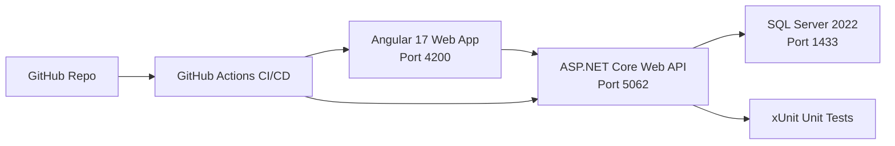

# Healthcare Patient Management System

Full-stack reference implementation using `C#/.NET 8`, `Angular 17`, and `SQL Server` with CI/CD on GitHub Actions.

## Architecture (Top Layer)



### Backend Architecture
- `Controllers`: API endpoints and request/response handling.
- `Services`: business logic (patient lifecycle, overlap-safe appointment scheduling).
- `Data`: EF Core `AppDbContext` and SQL Server mapping.
- `Domain`: entities (`Patient`, `Appointment`, `TreatmentPlan`).
- `Tests`: xUnit + in-memory DB tests for service layer.

### Frontend Architecture
- Standalone Angular app with reactive forms.
- `PatientApiService` for API communication.
- Single dashboard view for patient registration + appointment scheduling + read views.

## Project Structure

```text
.
├── src
│   ├── backend
│   │   ├── Healthcare.PatientManagement.Api
│   │   ├── Healthcare.PatientManagement.Tests
│   │   └── Healthcare.PatientManagement.sln
│   └── frontend
├── database
│   └── init.sql
├── docker-compose.yml
└── .github/workflows/ci-cd.yml
```

## Execution Guide

### Prerequisites
- `.NET SDK 8.0+`
- `Node.js 20+` and `npm`
- `Angular CLI 17+`
- `SQL Server 2022` (local or container)
- Optional: `Docker + Docker Compose`

### Option A: Run Locally (Recommended for development)

1. Start SQL Server and ensure this credential works:
   - User: `sa`
   - Password: `Your_strong_password123`
2. Update connection string if required:
   - File: `src/backend/Healthcare.PatientManagement.Api/appsettings.json`
3. Run API:
```bash
cd src/backend/Healthcare.PatientManagement.Api
dotnet restore
dotnet run
```
4. Run frontend (new terminal):
```bash
cd src/frontend
npm install
npx ng serve --port 4200
```
5. Open app:
   - Frontend: `http://localhost:4200`
   - Swagger: `http://localhost:5062/swagger`

### Option B: Run with Docker Compose

```bash
docker compose up --build
```

Endpoints after startup:
- Frontend: `http://localhost:4200`
- API: `http://localhost:5062`
- SQL Server: `localhost:1433`

Stop stack:
```bash
docker compose down
```

## Verification Checklist

### Backend
```bash
cd src/backend
dotnet test Healthcare.PatientManagement.sln --collect:"XPlat Code Coverage"
```

### Frontend
```bash
cd src/frontend
npm run build
```

### Manual Smoke Test
1. Open UI at `http://localhost:4200`.
2. Create a patient.
3. Schedule an appointment for that patient.
4. Verify records appear in patient and appointment tables.
5. Test conflict handling by adding overlapping appointment for same doctor.

## API Contract Snapshot

### `POST /api/patients`
```json
{
  "firstName": "Jane",
  "lastName": "Doe",
  "dateOfBirth": "1992-10-10",
  "email": "jane@example.com",
  "phoneNumber": "+1-555-1234",
  "gender": "Female"
}
```

### `POST /api/appointments`
```json
{
  "patientId": "<patient-guid>",
  "doctorName": "Dr. Patel",
  "startAtUtc": "2026-03-12T10:00:00Z",
  "endAtUtc": "2026-03-12T10:30:00Z",
  "reason": "Consultation"
}
```

## CI/CD

Workflow: `.github/workflows/ci-cd.yml`
- Backend job: restore, build, test, code coverage collection.
- Frontend job: npm install and production build.

## GitHub Push Steps

1. Create a new GitHub repository.
2. Add remote and push:
```bash
git init
git add .
git commit -m "Initial commit: healthcare patient management system"
git branch -M main
git remote add origin https://github.com/<your-username>/<repo-name>.git
git push -u origin main
```

## Notes
- The API bootstraps database schema on startup with `EnsureCreated()`.
- For production, replace with EF migrations and secure secret storage.
- Current CORS policy allows `http://localhost:4200`.
